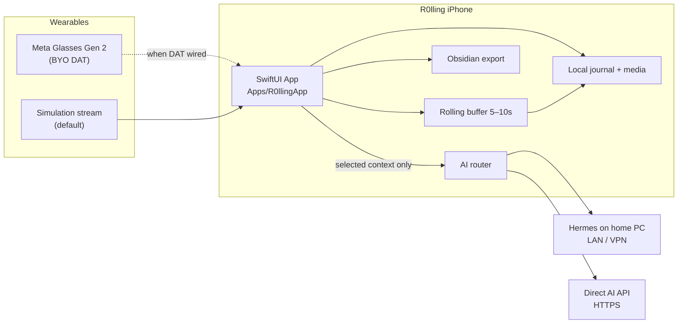

# R0lling

### Clip the moment. Keep the day.

**R0lling** (zero instead of the first *o*) is a local-first personal journal for iPhone — notes, photos, voice, and short rolling clips — built to pair with **Meta Glasses Gen 2** when you bring your own Device Access Toolkit (DAT).

Your memories live on the phone (and optionally as Markdown in Obsidian). AI is opt-in, never always-on. Glasses are optional; simulation mode is first-class.

<br/>

<p align="center">
  
  
  
  
  
</p>

<p align="center">
  
  
  
  
</p>

---

## Honest status (read this)

| Claim | Reality |
| --- | --- |
| Core journal + clip pipeline + AI adapters + Obsidian export | **Software-ready** — real Swift/SPM code, DI via `AppState` |
| Rolling buffer / camera stream | **Simulation-first** — test frames + playable placeholder MP4; Meta DAT is **commented out** in `Package.swift` until you flip it on Mac |
| Live Meta Glasses Gen 2 / DAT pairing | **Not device-proven** — bring-your-own DAT + hardware when available (`docs/LANE_CLIP_META.md`) |
| Build / `swift test` | **Mac + Xcode** (or GitHub Actions macOS runner) — Windows hosts run Python verification only |
| App Store / production | **Not approved** — personal engineering release; see `docs/AUDIT_FINAL.md` |

> Viral narrative ≠ fake demos. R0lling ships with clear `SIMULATION` labels and typed errors — never a fake “connected” glasses state.

---

## Why this exists

Wearables capture life. Most apps bury the moment in a cloud gallery you’ll never reopen.

R0lling is the opposite: a **day timeline** you own. Something happens — a joke, a street scene, a thought you want to tell someone later — you say *clip this* or hit the big Clip button, and the last **5–10 seconds** land in today’s journal. Notes become Markdown. Your agent gets a bounded memory folder. Hermes on the home PC or a Direct API — your choice, never a silent failover.

Atmosphere: dark Discord × Twitch energy for a personal journal — charcoal surfaces, lavender accents, LIVE only when the stream is actually running. LoggedIn-adjacent blues for trust; R0lling purple for the clip pulse.

---

## Feature grid

Labels: **Ready** = wired product path · **Sim** = works with simulation / placeholders · **Experimental** = code present, gated off (`FeatureReadinessRegistry.ready = false`)

### Core plan

| Feature | Label | Notes |
| --- | --- | --- |
| Daily journal + search + tags | Ready | Offline JSON journal · restart-safe |
| Media attach (photo / video / audio) | Ready / Sim | Paths wired · Photos picker proof on device |
| Rolling buffer 5–10s + Clip button | Sim | Ring buffer + AVAssetWriter placeholder; DAT remux when NALs exist |
| Voice command parser (`clip this` / `note this` / EL+EN) | Ready | Deduped finals · iPhone Speech fallback |
| Obsidian export + conflict sidecar | Ready | Idempotent Markdown · SHA256 · no silent overwrite |
| Agent folder (`Memory` / `Preferences` / `Open-loops`) | Ready | User-visible Markdown · PathAsfaleia |
| Dual AI: Hermes + Direct OpenAI-compatible | Ready / Sim | Keychain secrets · HTTPS / LAN allowlist · live credentials = you |
| «What am I seeing?» (single frame) | Ready / Sim | Vision path + on-device OCR; live vision needs a key |
| Observation game («find something red») | Ready / Sim | Manual fallback if vision unavailable |
| Backup / restore | Ready | Manifest + schema version |
| Meta Glasses Gen 2 live stream | Experimental / BYO DAT | Simulation adapter default · error `4002` without SDK |

### Sovereign Life OS v2.0 Hubs (7 Dedicated Tabs)

| Tab / Hub | Features & Engines | Status |
| --- | --- | --- |
| **Σήμερα** (`TodayView`) | Executive Suite (To-Do, Scratchpad, Stopwatch), Bevel 3-Ring Telemetry, Chief of Staff Quick Capture | Ready |
| **Βιο-Απόδοση** (`BiohackingHubView`) | Full-Spectrum HealthKit 2x3 Grid, Iron Tonnage Logger, Box Breathing 4x4, Circadian Sunlight & Caffeine | Ready |
| **Studio** (`CreativeStudioHubView`) | Multi-Format Content Transformer (X/LinkedIn/Newsletter), Zettelkasten Live Strip, Dream Correlation, Logic Fallacy Auditor | Ready |
| **Στρατηγείο** (`StrategicVaultHubView`) | 90-Day Decision Journal, Future Letterbox Capsule, Board of Advisors Simulator, Air-Gapped Firewall, FaceID Vault | Ready |
| **Ημερολόγιο** (`CalendarView`) | Time Capsule «Σαν Σήμερα», Circadian Schedule, Filtered Search | Ready |
| **Βοηθός** (`AssistantView`) | Offline Autonomous Jarvis Agent, Deep Work Pacer, Local Obsidian Memory | Ready |
| **Ρυθμίσεις** (`SettingsView`) | Full-Spectrum HealthKit Permissions, Privacy Manifests, Zero-Knowledge Storage Scrubber | Ready |

### Super-features & 40 Extended Engines (Software-Ready)

| Category | Modules & Engines | Status |
| --- | --- | --- |
| **Neuro-Cognitive** | DopaminePacer, OcularFatigue, WorkingMemory, VerbalEntropy, PinkNoise, MentalStateAnchor, SelfTalkSentiment, CircadianChronoPeak | Ready |
| **Biomechanical & Athletic** | BarbellVelocity, HeartRateRecovery, HydrationOsmolality, SaunaHeatShock, StepPacing, CO2Tolerance, DomsReadiness, FastingAutophagy | Ready |
| **Cryptography & Defensive** | ShamirKeyShard, AcousticLeak, PanicDecoy, BleSurveillance, EphemeralVoice, NetworkExfiltration, ExifScrubber, ProofOfExistence | Ready |
| **Executive Operations** | NegotiationRehearsal, EnergyRoiTask, AntiProcrastination, SecondOrderThinking, TimeSinkAuditor, OpenLoopExterminator, AdvisoryBoard, DailyMomentum | Ready |
| **Sensory & Creative** | AcousticSoundscape, VoicePitchBiofeedback, PerspectiveRectifier, SpatialLociMemory, KindleClippings, ConceptWireframe, DreamSymbolCorrelation, GenerationalLegacy | Ready |


---

## Architecture



```text
R0lling/
├── Package.swift              # SPM library (DAT dep commented)
├── Apps/R0llingApp/           # iOS host scaffold · Info.plist · XcodeGen
├── Sources/R0lling/
│   ├── App/  AI/  Buffer/  Core/  Game/
│   ├── Glasses/  Obsidian/  Persistence/  Speech/  UI/
│   └── Experimental/          # orphans · ready=false
├── Tests/R0llingTests/
├── verification/              # Python mirrors (Windows-friendly)
└── docs/                      # AUDIT · SETUP · DEVICE_TESTS · DECISIONS
```

---

## Quick start (Mac)

**Needs:** macOS 14.4+ · Xcode 16+ (Swift 6) · iPhone / Simulator on iOS 17+

```bash
git clone https://github.com/train-cell/R0lling.git
cd R0lling

# Library smoke
swift build
swift test

# Or open the package and run the host
open Package.swift
```

### iOS app target

There is no committed `.xcodeproj` (merge thrash). Follow **`Apps/R0llingApp/README.md`**:

1. New iOS App → add local SPM package `R0lling`
2. Replace Info with `Apps/R0llingApp/Info.plist` (camera / mic / speech / Bluetooth / local network strings)
3. Sign with your Personal Team · unique Bundle ID
4. Simulator: enable **Simulation Mode** in Settings — no glasses required
5. Optional Meta DAT: uncomment the package in `Package.swift` and follow `docs/LANE_CLIP_META.md`

### Keys (never in the repo)

| Secret | Where |
| --- | --- |
| Direct AI API key | iOS **Keychain** via Settings |
| Hermes bearer token | Keychain · private LAN/VPN endpoint only |
| Meta Developer registration | Your Meta account · see `docs/SETUP_META.md` |

Empty key → typed error before network. No secrets in logs or toasts.

### Windows / CI without Xcode

```bash
python verification/verify_all_subsystems.py
python verification/diagnose_stage5_finalize.py
```

Cloud macOS: `.github/workflows/swift-ci.yml`

---

## Privacy · local-first

- Journal and media stay in the **iPhone sandbox** by default.
- Obsidian is a **one-way export** in v1 (conflict-safe) — not a silent cloud sync.
- AI receives **only** the note, frame, or context you select — never continuous video upload.
- Hermes is for **your** home PC; do not expose the gateway to the public internet.
- Release builds kill the remote mirror stream (`broadcastFrame` no-op) until TLS identity exists.
- You can use the journal with **zero** glasses, Obsidian, or AI credentials.

---

## Roadmap

| Milestone | Status |
| --- | --- |
| Software objective (plan A01–A16 SW rows) | Done — see `docs/GOAL_100_PROGRESS.md` |
| Green `swift test` / GHA on macOS | Checklist in `docs/DEVICE_TESTS.md` |
| Wire MetaWearablesDAT · Gen 2 stream proof | Bring-your-own · `docs/LANE_CLIP_META.md` |
| Device matrix DEV-01…10 · 0/16 → filled | Blocked on hardware |
| Stage 6 only with real device failure report | Policy — no fake Stage 6 |
| Wave-D+ super-features | Frozen until A05/A10 device proof |

---

## Contributing

1. Prefer small, surgical PRs — journal / buffer / AI / glasses stay separable.
2. No silent mocks of success (connection, save, AI reply, LIVE badge).
3. Keep secrets out of git; use Keychain + `.env` locally (already gitignored).
4. New “super” features start behind `FeatureReadinessRegistry` with `ready: false`.
5. Open an issue with host (Mac/Windows), sim vs device, and the exact error code.

---

## Docs map

| Doc | Purpose |
| --- | --- |
| [`docs/AUDIT_FINAL.md`](docs/AUDIT_FINAL.md) | Canonical CTO audit |
| [`docs/CAPABILITY_MATRIX.md`](docs/CAPABILITY_MATRIX.md) | What Gen 2 / SDK can do vs R0lling |
| [`docs/DECISIONS.md`](docs/DECISIONS.md) | Sim-only v1 · DAT · Experimental freeze |
| [`docs/SETUP_META.md`](docs/SETUP_META.md) | Developer Mode / pairing |
| [`docs/SETUP_AI_HERMES.md`](docs/SETUP_AI_HERMES.md) | Dual AI connectors |
| [`docs/OBSIDIAN_DATA.md`](docs/OBSIDIAN_DATA.md) | Vault layout · Agent folder |
| [`docs/DESIGN.md`](docs/DESIGN.md) | Discord × Twitch tokens |
| [`docs/DEVICE_TESTS.md`](docs/DEVICE_TESTS.md) | Hardware proof checklist |

---

## License

[MIT](LICENSE) — use it, fork it, clip your own moments.

---

<p align="center">
  <sub>R0lling · personal wearable memory · software-ready · simulation-first · glasses when you bring DAT</sub>
</p>

---

<details>
<summary>Ελληνικά (σύντομο)</summary>

**R0lling** = προσωπικό local-first ημερολόγιο iPhone με rolling clips 5–10s, Obsidian export και διπλό AI (Hermes / Direct API).  
**Όχι** device-proven στα Gen 2 ακόμη — simulation-first· Meta DAT = bring-your-own σε Mac.  
Λεπτομέρειες: `docs/AUDIT_FINAL.md` · `docs/DECISIONS.md` §2.

</details>
