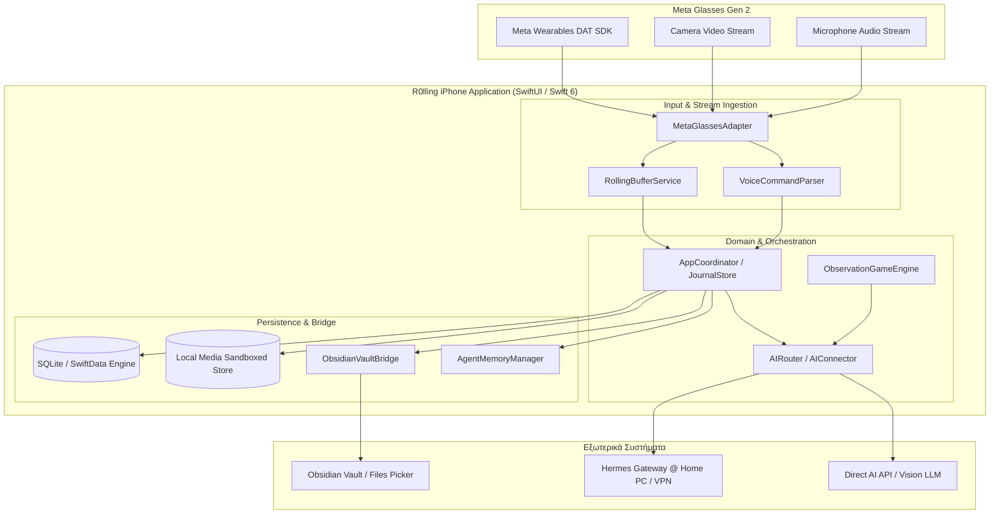

# R0lling — Τεχνικό Blueprint (Technical Blueprint) v1.0

**Έργο:** `R0lling` (iOS Swift/SwiftUI Local-First Journal & Wearable Hub)  
**Στόχος Συσκευών:** iPhone (iOS 17.2+) & Meta Glasses Gen 2 (Meta DAT SDK 1.0+)  
**Ημερομηνία:** 6 Οκτωβρίου 2026  
**Στάδιο:** Στάδιο 1 — Αρχιτεκτονικός Σχεδιασμός & Προδιαγραφές  

---

## 1. Σύνοψη Αρχιτεκτονικής (System Architecture)

Το **R0lling** είναι μία τοπική (local-first) εφαρμογή καταγραφής ημερολογίου, εμπλουτισμένη με ροή βίντεο hands-free από Meta Glasses Gen 2, προσωρινό κυλιόμενο buffer (rolling buffer 5–10s) για άμεσο αναδρομικό clipping («clip this»), αναγνώριση φωνής («note this»), συγχρονισμό με Markdown vault στο Obsidian, και διπλή διασύνδεση AI (Hermes Gateway στο home PC ή απευθείας OpenAI-compatible API).



---

## 2. Modules & Κατανομή Αρμοδιοτήτων

| Module | Namespace | Περιγραφή & Αρμοδιότητες |
|---|---|---|
| **App** | `R0lling.App` | Lifecycle, `AppCoordinator`, Global Dependency Injection, Root Views & Router. |
| **Core** | `R0lling.Core` | Immutable Domain Models (`JournalEntry`, `MediaAttachment`, `BufferConfig`, `AISettings`, `AgentMemory`). |
| **Persistence** | `R0lling.Persistence` | Τοπική αποθήκευση SQLite / SwiftData, Transactions, Versioning (Schema v1), Backup & Restore Manager. |
| **Buffer** | `R0lling.Buffer` | Ring-buffer encoded `CMSampleBuffer` ή MP4 micro-segments, keyframe indexing, concurrent snapshot locking, MP4 export. |
| **Glasses** | `R0lling.Glasses` | Υλοποίηση Meta DAT SDK protocol, Bluetooth connection, Camera session, stream state machine, fallback test mode. |
| **Speech** | `R0lling.Speech` | Apple Speech Framework & Whisper fallback, command regex scrubber (`note this`, `clip this`, ελληνικά aliases), deduplication. |
| **Obsidian** | `R0lling.Obsidian` | `UIDocumentPicker` security-scoped bookmarking, Markdown generation (`YYYY/MM/YYYY-MM-DD.md`), conflict detection via SHA256 hashes. |
| **AI** | `R0lling.AI` | Κοινό `AIConnector` protocol, `DirectAPIConnector`, `HermesConnector` (Bearer Auth, Private IP), Context Scrubber, Vision Request builder. |
| **Game** | `R0lling.Game` | `ObservationGameEngine`, mission generator («Βρες κάτι κόκκινο»), evaluation prompt, scoring & progressive levels. |
| **UI** | `R0lling.UI` | Discord × Twitch design system (`#16161D`, `#7742DC`, `#A78BFA`), Today timeline, Calendar view, Assistant chat, Settings. |

---

## 3. Κυκλικός Buffer (Rolling Buffer 5–10s) — Λεπτομερής Αλγόριθμος

### 3.1 Απαιτήσεις & Περιορισμοί Μνήμης
1. **Μορφή δεδομένων:** Αντί για ασυμπίεστα `CVPixelBuffer` (~3MB ανά frame στα 1080p, άρα 900MB για 10 δευτερόλεπτα στα 30fps), ο buffer διατηρεί **HEVC/H.264 compressed `CMSampleBuffer`s** ή **Rolling Segments (AVAssetWriter fragment slices)**.
2. **Μέγεθος στη μνήμη:** Στα 8Mbps bitrate, 10 δευτερόλεπτα καταλαμβάνουν ~10MB μνήμης RAM, παρέχοντας 100% ασφάλεια από OOM (Out Of Memory) crashes στο iOS.
3. **Keyframe Alignment:** Κάθε clip ΠΡΕΠΕΙ να ξεκινά από IDR/I-Frame (Keyframe). Αν το trigger $T$ ζητά 10s αλλά το πλησιέστερο keyframe είναι στα 9.4s, το clip ξεκινά ακριβώς στο keyframe για να αποτρέψει corruption στην αποκωδικοποίηση.

### 3.2 Αλγόριθμος Trigger & Concurrency Locking
```text
1. Ροή καρέ -> appendSampleBuffer(sample, isVideo, timestamp)
2. RingBuffer.trimOldSamples(threshold: currentTimestamp - maxBufferDuration - safetyMargin)
3. Κατά το Trigger(T, requestedDuration):
   a. Απομόνωση snapshot των buffers (Video & Audio) υπό NSLock / Actor isolation.
   b. Εύρεση του πρώτου Video Keyframe <= (T - requestedDuration).
   c. Δημιουργία IsolatedSlice(samples, startTime, endTime).
   d. Ο κυρίως buffer συνεχίζει να δέχεται νέα frames χωρίς καθυστέρηση.
   e. Ασύγχρονο export μέσω AVAssetWriter -> Sandbox Media/Clips/clip_UUID.mp4.
   f. Επαλήθευση μεγέθους αρχείου (> 0 bytes) & διάρκεια.
   g. Εγγραφή στο JournalEntry με source = .glassesClip.
```

---

## 4. Obsidian Sync & Agent Memory Structure

### 4.1 Δομή Φακέλων Vault
```text
R0lling/
├── 2026/
│   └── 10/
│       └── 2026-10-06.md
├── Agent/
│   ├── Memory.md
│   ├── Preferences.md
│   └── Open-loops.md
└── Attachments/
    ├── Photos/
    ├── Videos/
    ├── Clips/
    └── Audio/
```

### 4.2 Κανόνες Συγχώνευσης & Ανίχνευσης Συγκρούσεων
- Κάθε entry στο Markdown φέρει σχόλιο metadata HTML: `<!-- r0lling:entry-id:UUID:sha256:... -->`.
- Πριν από κάθε export:
  1. Υπολογισμός hash του υπάρχοντος αρχείου στο Obsidian.
  2. Αν το hash διαφέρει από το τελευταίο γνωστό export hash, επισημαίνεται ως **Εξωτερική Αλλαγή (External Modification)**.
  3. Δεν γίνεται σιωπηρή αντικατάσταση. Αντίθετα, διατηρείται το εξωτερικό περιεχόμενο και προσαρτάται το νέο entry, ή δημιουργείται backup `.conflict.md`.

---

## 5. Διπλή Διασύνδεση AI (Hermes vs Direct API)

### 5.1 Hermes Connector (Home PC Gateway)
- **Base URL:** Π.χ. `http://192.168.1.50:8080/v1` (ή μέσω WireGuard/Tailscale VPN `http://100.x.y.z:8080/v1`).
- **Auth:** `Bearer <HERMES_API_KEY>` αποθηκευμένο με ασφάλεια στο iOS Keychain.
- **Payload Scrubber:** Στέλνει ΜΟΝΟ τα σχετικά entries ή τη συγκεκριμένη εικόνα. Δεν διαβάζει το sandbox του iPhone χωρίς ρητή αποστολή.
- **Failover Behavior:** Αν ο server δεν αποκρίνεται εντός του timeout (15s), επιστρέφει σαφές UI μήνυμα `Hermes Offline / Unreachable`. ΔΕΝ γίνεται αυτόματη σιωπηρή εκτροπή σε cloud provider για λόγους ιδιωτικότητας.

### 5.2 Direct API Connector (OpenAI Compatible)
- **Base URL:** Π.χ. `https://api.openai.com/v1` ή οποιοδήποτε συμβατό endpoint.
- **Model:** Παραμετροποιήσιμο (π.χ. `gpt-4o`, `gemini-1.5-flash-latest`).
- **Vision:** Υποστηρίζει Base64 εικόνα για το «What am I seeing?» και το παιχνίδι παρατήρησης.

---

## 6. UI & Design System (Discord × Twitch Aesthetic)

- **Χρώματα:**
  - Background Dark: `#16161D`
  - Surface Card: `#22232D`
  - Elevated Container: `#2C2D39`
  - Primary Accent (Twitch/Discord Purple): `#7742DC`
  - Secondary Accent (Soft Lavender): `#A78BFA`
  - Success Indicator: `#55D6A4`
  - LIVE Badge: `#FF4F64`
- **Navigation:**
  1. `Σήμερα (Today)`: Message-like stream, quick composer, floating clip button.
  2. `Ημερολόγιο (Calendar)`: Month/Day picker, filter by tags/media type, search bar.
  3. `Βοηθός (Assistant)`: Jarvis chat, memory inspector, observation game shortcut.
  4. `Ρυθμίσεις (Settings)`: Glasses status, AI selection, Obsidian vault picker, backup/export.
